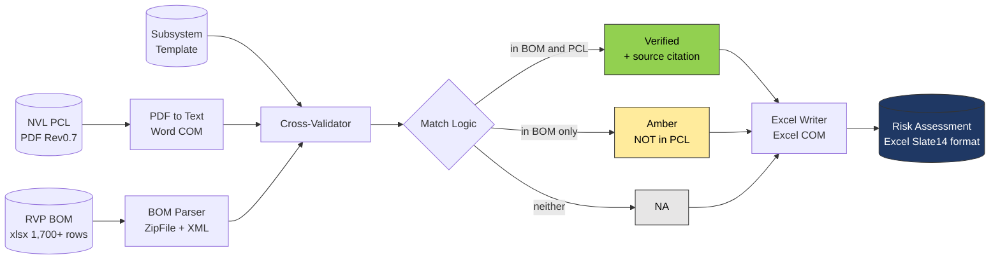
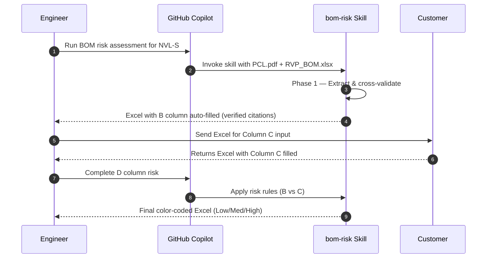
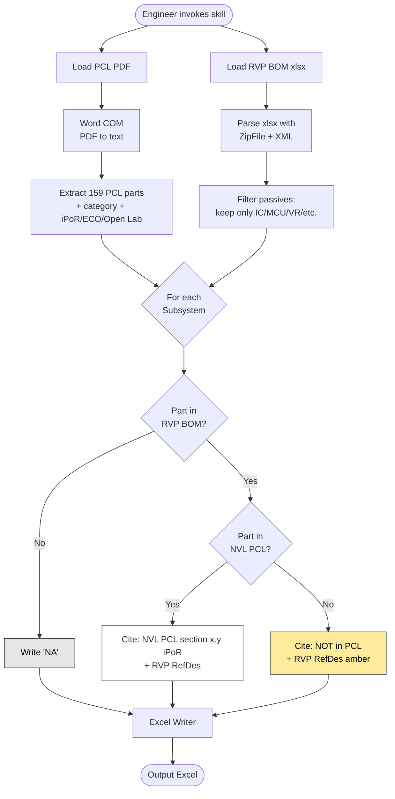
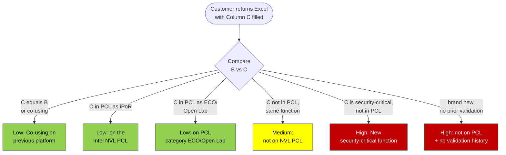
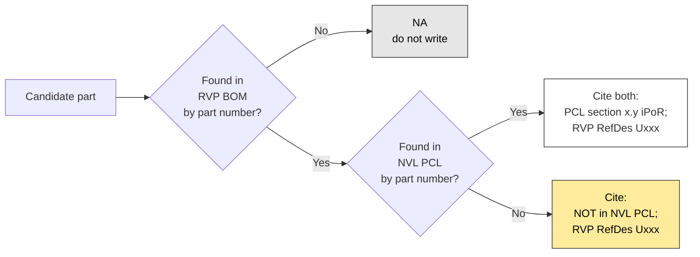

# BOM Risk Assessment — AI-Assisted Skill for Platform Migration

> **GitHub Copilot Skill** · Intel Hardware Engineering · Platform BOM Review Automation

[](https://code.visualstudio.com/)
[](https://www.intel.com/)
[](#)

---

## Table of Contents

- [Executive Summary](#executive-summary)
- [Problem Statement](#problem-statement)
- [Solution Architecture](#solution-architecture)
- [End-to-End Workflow](#end-to-end-workflow)
- [Data Verification Pipeline](#data-verification-pipeline)
- [Output Specification](#output-specification)
- [Risk Classification Logic](#risk-classification-logic)
- [Coverage Statistics](#coverage-statistics)
- [Repository Structure](#repository-structure)
- [Quick Start](#quick-start)
- [Technical Stack](#technical-stack)
- [Roadmap](#roadmap)

---

## Executive Summary

A GitHub Copilot Skill that **automates platform-migration BOM risk reviews** for Intel hardware projects. The skill reads the raw RVP BOM (1,700+ rows) and the official PCL PDF, cross-validates each component against both sources, and produces a color-coded risk-assessment Excel formatted to Intel platform-review standards.

| Metric | Manual Process | With This Skill |
|---|---|---|
| BOM-to-Risk Excel turnaround | **6 – 9 hours** | **~10 minutes** |
| Subsystem rows reviewed | 38 (manual lookup each) | 38 (auto-validated) |
| Component-source verification | Tribal knowledge | **Dual-source verified (BOM ∩ PCL)** |
| Output consistency | Engineer-dependent | Standardized template |

---

## Problem Statement

Every NVL platform migration requires a BOM risk review. The manual workflow is:

1. Open the customer-supplied raw RVP BOM (~1,700 rows containing capacitors, resistors, ICs, connectors, etc.)
2. Manually filter out passives, identify 30–50 ICs of interest
3. Cross-reference each IC against the **NVL PCL PDF** (159 components, 15 categories) by hand
4. Map each finding to a fixed 38-entry Subsystem template
5. Hand-write the Risk Assessment & Recommendation column with Low / Medium / High color coding

**Pain points:**
- Highly time-consuming and repetitive
- Easy to fabricate or hallucinate part numbers when memory fails
- Inconsistent format between engineers
- No traceability — no record of *where* a part number came from

---

## Solution Architecture



---

## End-to-End Workflow



### Phase 1 — Reference BOM Generation (Column B)



### Phase 2 — Risk Assessment (Column D)



---

## Data Verification Pipeline

The skill enforces a **strict dual-source rule** to eliminate hallucinated data:



> **Zero-hallucination policy:** if a part is not present in EITHER source, the cell is written as `NA`. The skill never invents part numbers.

---

## Output Specification

The output Excel matches the Intel **Slate14 MLK BOM** review template:

| Column | Title | Header Background | Filled By |
|--------|-------|-------------------|-----------|
| A | Subsystem | Dark Blue `#1F3864` | Fixed template |
| B | NVL-S RVP Reference BOM | Mid Blue `#2E4A7A` | **AI** (auto-validated) |
| C | Customer BOM | Mid Blue `#2E4A7A` | Customer |
| D | Risk Assessment & Recommendation | Dark Red `#8B0000` | **AI** (after C) |

**Cell colors:**

| Style | Color | Meaning |
|-------|-------|---------|
| Even row | `#DCE6F1` light blue | Zebra stripe for readability |
| Odd row | `#FFFFFF` white | Zebra stripe for readability |
| D Low Risk | `#92D050` green | Co-using or in PCL iPoR |
| D Medium Risk | `#FFFF00` yellow | Not in PCL, validation needed |
| D High Risk | `#C00000` red | Security-critical new component |

---

## Risk Classification Logic

| Condition | Risk | D-column Template |
|-----------|------|-------------------|
| `C == B` (identical) | Low | `Low: Co-using on <PrevPlatform>` |
| C is in PCL as **iPoR** | Low | `Low: on the Intel NVL PCL platform` |
| C is in PCL as **ECO** | Low | `Low: on the Intel NVL PCL (Category: ECO)` |
| C is in PCL as **Open Lab** | Low | `Low: on the Intel NVL PCL (Category: Open Lab)` |
| C not in PCL, same function as B | Medium | `Medium: not on NVL PCL — <reason>` |
| C is security-critical (TPM, Tamper, Secure Boot) and not in PCL | High | `High: New security-critical function` |
| C is brand new, no validation history | High | `High: not on PCL + no prior validation` |

Full rules: [references/risk_criteria.md](references/risk_criteria.md)

---

## Coverage Statistics

> **Validated against:** `NVL-S_S021_UDIMM_1DPC_BOM.xlsx` (47 ICs after passive filtering) and `NVL_PCL_Rev0.7` (159 components)

| Status | Count | Background | Notes |
|--------|------:|------------|-------|
| Verified (in BOM and in PCL) | **9 / 38** | white | Cited with PCL section + RefDes |
| In BOM but NOT in PCL | **3 / 38** | amber | Customer must validate |
| NA (not in this BOM, or PCL doesn't cover) | **26 / 38** | gray | DT BOM has no sensors/charger/TBT |

### Verified Component Inventory (NVL-S DT)

| Subsystem | Part Number | PCL Reference | RVP RefDes |
|-----------|-------------|---------------|------------|
| Embedded Controller | `NPCX4885A0DX` | §4.3 iPoR | U9G1 |
| IMVP9.3 Controller | `RTQ3700HHN` | §8.6 iPoR | EU1B1 |
| IMVP9.3 Power Stage | `TDA21590` | (Infineon) | various |
| VNNAON | `AOZ23567BQI` | §8.9 iPoR (For NVL-S) | EU3B1 |
| HDMI Retimer | `PS8219` | §9.2 iPoR | EU1A3 |
| USB3 Redriver | `PI3EQX1014` | §15.1 iPoR | EU5A2 |
| USB3 Redriver | `PI3EQX1002E` | §15.10 iPoR | EU5T1, EU5U1 |
| USB-C Retimer | `PS8825` | §15.11 iPoR | EU5B1 |
| LAN | `I219LM` | §2.2 iPoR | EU4B1 |
| BIOS SPI Flash | `W25R512NWEIQ` | §12.2 iPoR | – |

### Amber Components (in BOM, not in PCL)

| Subsystem | Part Number | Reason |
|-----------|-------------|--------|
| USB-C PD Controller | `ANX7498` (Analogix) | PCL PD only lists TI parts |
| Audio Codec | `ALC722-CG` (Realtek) | PCL Audio only lists Cirrus/Everest/ON |
| GPIO Expander | `PCA9555PW/G` | PCL does not cover GPIO Expander category |

---

## Repository Structure

```
BOM_risk/
├── .github/
│   └── skills/
│       └── bom-risk/                     ← Copilot Skill package
│           ├── SKILL.md                  ← Skill definition (auto-loaded)
│           ├── README.md                 ← This document
│           ├── scripts/
│           │   ├── bom_reader.py         ← Parse RVP BOM xlsx
│           │   └── bom_writer.py         ← Generate output Excel
│           └── references/
│               ├── risk_criteria.md      ← Risk classification rules
│               └── subsystem_template.md ← Fixed 38-entry template
├── NVL-S_S021_UDIMM_1DPC_BOM.xlsx        ← Sample input (RVP BOM)
├── 870781_NVL_DT_Mobile_PCL_Rev0p7.pdf   ← Sample input (PCL)
├── Slate14 MLK BOM_0414_2 (1).xlsx       ← Output format template
└── NVL-S_BOM_Risk_Assessment.xlsx        ← Sample output
```

---

## Quick Start

### Prerequisites

- Windows 10/11
- Microsoft Office (Excel + Word) — for COM automation
- Python 3.x (stdlib only — no `pip install` required)
- VS Code with GitHub Copilot extension
- Network access NOT required after initial install

### Installation

```powershell
# 1. Clone repository
git clone https://github.com/<your-org>/bom-risk-skill.git
cd bom-risk-skill

# 2. Place skill in your project's .github/skills/ folder
Copy-Item -Recurse .github\skills\bom-risk <your-project>\.github\skills\
```

### Usage

1. Open VS Code in your project workspace
2. Open GitHub Copilot Chat
3. Ask:
   > *"Perform NVL-S BOM risk assessment using `<PCL.pdf>` and `<RVP_BOM.xlsx>`"*
4. Skill auto-generates `<Project>_BOM_Risk_Assessment.xlsx` with Column B filled
5. Send Excel to customer to fill Column C
6. Return to Copilot:
   > *"Complete Column D risk assessment"*

---

## Technical Stack

| Layer | Technology | Why |
|-------|-----------|-----|
| Skill definition | VS Code Copilot Skills (`SKILL.md` + YAML frontmatter) | Native Copilot discovery |
| PDF text extraction | Word 16.0 COM (`SaveAs2` format 2) | No external library; handles encrypted Intel PCL PDFs |
| BOM parsing | Python `zipfile` + `xml.etree` | No `openpyxl` dependency (network-restricted environments) |
| Excel generation | Excel COM via PowerShell | Native cell formatting, Slate14 color matching |
| Cross-validation | Python regex matching | Part-number normalization across BOM and PCL |

---

## Roadmap

- [x] NVL-S Desktop platform (S021 UDIMM 1DPC RVP)
- [ ] NVL-H / NVL-UL / NVL-AX / NVL-AM platform variants
- [ ] PTL / ARL legacy PCL support for cross-generation co-using analysis
- [ ] Multi-language risk text generation (EN/CN)
- [ ] Web-based GitHub Action (CI/CD integration)
- [ ] Auto-generation of customer-side input template
- [ ] PCL Rev tracking and diff between PCL revisions

---

## License & Attribution

This skill is for internal Intel hardware engineering use. The PCL document is Intel Confidential. Component data shown is from publicly accessible RVP reference designs.

---

*Maintained by Intel Hardware Engineering · Built with GitHub Copilot Agent Mode*
