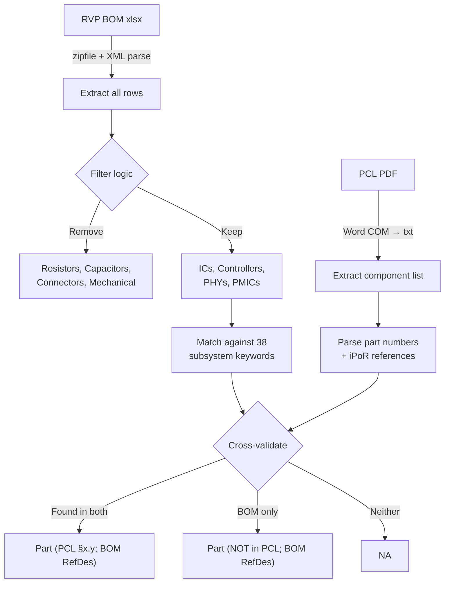

# BOM Risk Assessment — Technical Reference

> Deep-dive documentation for the BOM Risk Assessment Copilot Skill.  
> For overview and quick start, see the [main README](../../../README.md).

---

## Usage SOP (EN/ZH)

For share-ready one-page SOP cards in English and Traditional Chinese, see:

- [One-Page SOP Cards (GitHub Copilot Skill)](../../../README.md#one-page-sop-cards-github-copilot-skill)

---

## SKILL.md Specification

The skill is invoked automatically when Copilot detects BOM risk assessment intent.  
Trigger phrases: `BOM risk`, `platform migration review`, `risk assessment`.

---

## Processing Pipeline

### Phase 1: Column B (RVP Reference BOM)



### Phase 2: Column D (Risk Assessment)

Triggered after customer fills Column C.

| Condition | Risk | Color |
|-----------|:----:|:-----:|
| Customer part = RVP part (in PCL) | Low | `#92D050` |
| Customer part ≠ RVP but same vendor/family | Medium | `#FFFF00` |
| Different vendor or no validation data | High | `#C00000` |
| Security-critical subsystem (TPM, EC, BIOS flash) without PCL match | High | `#C00000` |
| Customer part in PCL but different subsystem | Medium | `#FFFF00` |

Full decision tree: [references/risk_criteria.md](references/risk_criteria.md)

---

## IC Filter Logic

**Keep** (keywords that indicate ICs):
```
Controller, IC, PHY, PMIC, Regulator, MOSFET, Driver, 
Codec, Amplifier, Retimer, Redriver, Mux, Switch, 
Flash, EEPROM, TPM, EC, Sensor (IMU/Accel only)
```

**Remove** (passive/mechanical):
```
Resistor, Capacitor, Inductor, Ferrite, Diode, Crystal, 
Oscillator, Connector, Header, Socket, Screw, Standoff,
Thermal pad, Heatsink, Label, PCB
```

---

## Subsystem Mapping

38 fixed entries. Each maps to BOM keywords:

| # | Subsystem | BOM Keywords |
|---|-----------|-------------|
| 1 | Processor / SoC | CPU, Processor, SoC |
| 2 | PCH / Chipset | PCH, Chipset |
| 3 | Memory (DRAM) | DDR, DIMM, DRAM |
| 4 | BIOS SPI Flash | SPI, Flash, W25 |
| 5 | EC | NPCX, EC, Embedded Controller |
| ... | ... | ... |

Full list: [references/subsystem_template.md](references/subsystem_template.md)

---

## Excel Output Spec (Slate14)

### Color Palette

| Element | Hex | RGB | Usage |
|---------|-----|-----|-------|
| Header A | `#1F3864` | 31,56,100 | Column A header |
| Header B/C | `#2E4A7A` | 46,74,122 | Column B/C headers |
| Header D | `#8B0000` | 139,0,0 | Column D header |
| Even row | `#DCE6F1` | 220,230,241 | Alternating fill |
| Low risk | `#92D050` | 146,208,80 | Column D cell |
| Medium risk | `#FFFF00` | 255,255,0 | Column D cell |
| High risk | `#C00000` | 192,0,0 | Column D cell |

### Cell Formatting

- Font: Calibri 10pt
- Header: Bold, white text, centered
- Data rows: Left-aligned, wrap text
- Column widths: A=30, B=50, C=50, D=45

---

## Scripts

### `bom_reader.py`

Reads xlsx without openpyxl (uses `zipfile` + `xml.etree.ElementTree`).

**Input:** RVP BOM xlsx path  
**Output:** JSON array of `{row, partNumber, description, refDes, quantity}`

### `bom_writer.py`

Generates Excel via PowerShell COM subprocess.

**Input:** List of `(subsystem, colB_text, colC_text, colD_text, risk_level)`  
**Output:** Color-coded xlsx at specified path

---

## Limitations

- Requires Windows (Office COM automation)
- PDF extraction quality depends on PDF structure
- Network-isolated: no pip install, no API calls
- Single-sheet BOM only (first sheet parsed)

---

<p align="center"><sub>Technical reference for <a href="../../../README.md">BOM Risk Assessment Skill</a></sub></p>
