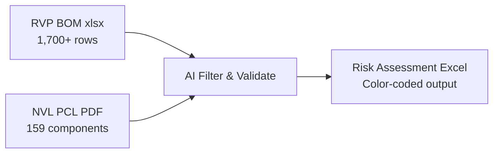
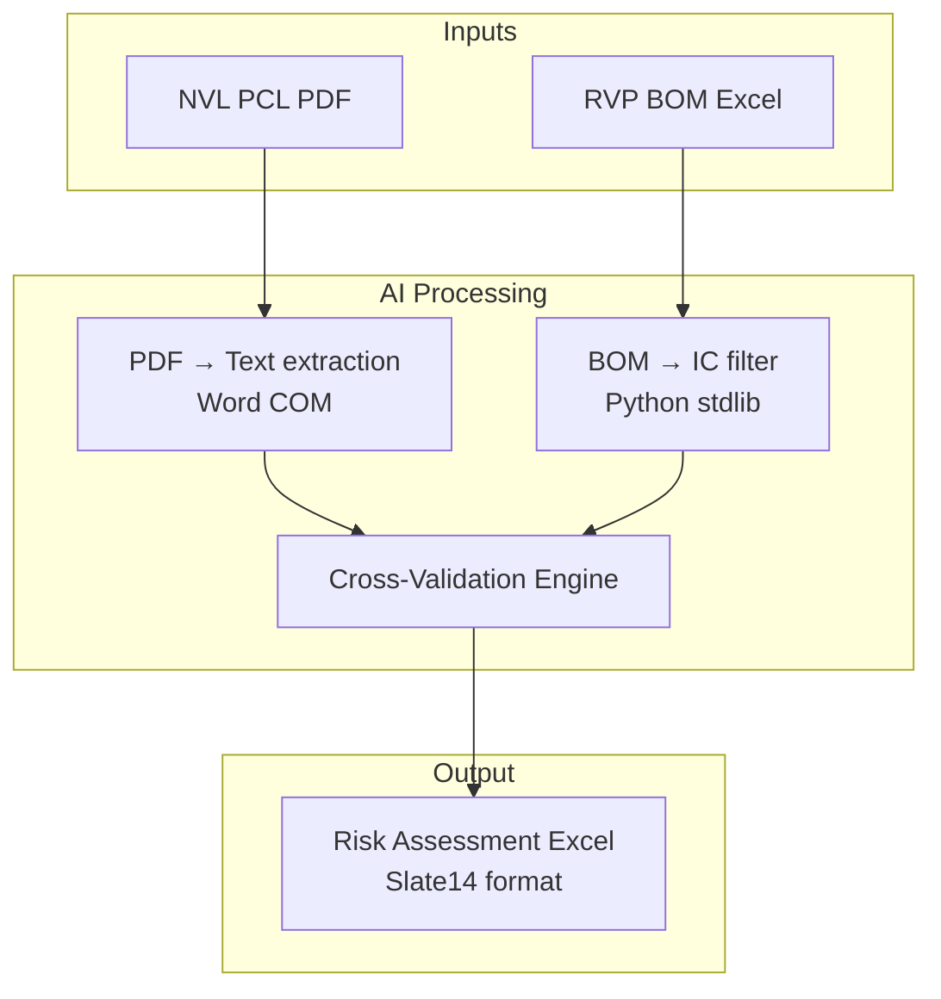
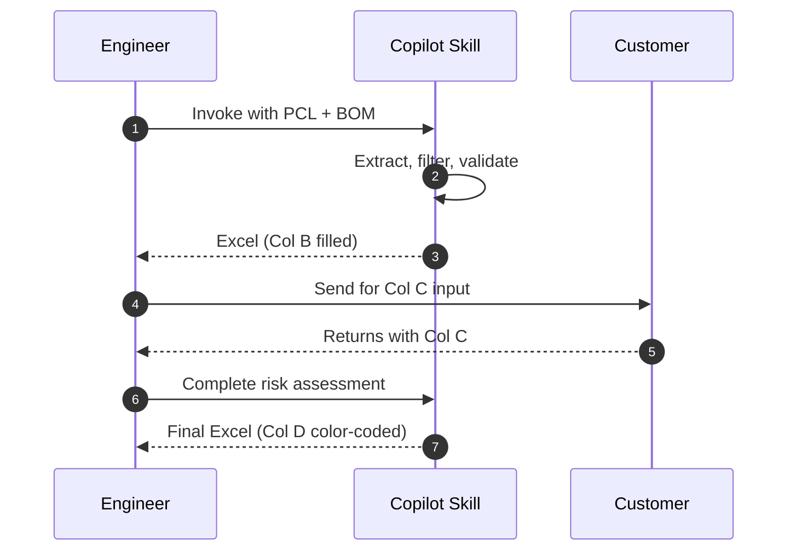

# BOM Risk Assessment Skill

<p align="center">
  
  
  
</p>

> AI-powered BOM risk assessment tool for Intel platform migrations.  
> Reduces review time from **6+ hours to under 10 minutes** per project.

---

<details>
<summary>🇨🇳 中文版 (Click to expand)</summary>

## 概述

此工具是 GitHub Copilot Skill，用於自動化 Intel 平台遷移 BOM 風險評估。

**核心功能：**
- 從 RVP BOM (1,700+ 行) 中自動過濾出 IC 元件
- 對照 PCL PDF 交叉驗證每個零件
- 輸出 Slate14 格式的彩色風險報告 Excel

**效益：** 每案 6-9 小時 → 10 分鐘

**使用方式：**
1. VS Code 中開啟 Copilot Chat
2. 輸入：`Perform NVL-S BOM risk assessment`
3. 提供 PCL PDF + RVP BOM Excel
4. AI 自動產出 B 欄（RVP 參考）
5. 客戶填 C 欄後，AI 自動完成 D 欄風險評估

**驗證原則：** 雙重來源驗證（BOM ∩ PCL），沒有就填 NA，絕不虛構。

</details>

---

## What It Does



This skill automates the most labor-intensive step in platform-migration BOM reviews:

| Step | Before (Manual) | After (AI Skill) |
|------|:-:|:-:|
| Filter ICs from raw BOM | 2–3 hrs | Instant |
| Cross-reference against PCL | 1–2 hrs | Instant |
| Fill reference BOM column | 1 hr | Auto |
| Risk assessment + color coding | 1–2 hrs | Auto |
| **Total** | **6–9 hrs** | **~10 min** |

---

## Architecture



---

## Workflow



---

## Output Format

Matches Intel Slate14 BOM review standard:

| Column | Content | Filled By |
|--------|---------|-----------|
| **A** | Subsystem (fixed 38 entries) | Template |
| **B** | RVP Reference BOM | **AI** |
| **C** | Customer BOM | Customer |
| **D** | Risk Assessment & Recommendation | **AI** |

**Risk colors in Column D:**

| 🟢 Green | 🟡 Yellow | 🔴 Red |
|:-:|:-:|:-:|
| Low Risk | Medium Risk | High Risk |
| In PCL / Co-using | Not in PCL | Security-critical / No validation |

---

## Verification Policy

Every cell in Column B is backed by a traceable source:

```
✅ In PCL + In BOM  →  "Part XYZ (NVL PCL §x.y iPoR; RVP RefDes EUxxx)"
⚠️ In BOM only      →  "Part XYZ (NOT in NVL PCL; RVP RefDes EUxxx)"
⬜ Neither           →  "NA"
```

> **Zero-hallucination guarantee:** No part number is written unless found in the actual source files.

---

## Quick Start

```powershell
# Clone
git clone https://github.com/billhsie/BOM_Risk_Assessment.git

# Copy skill to your project
Copy-Item -Recurse .github\skills\bom-risk <your-project>\.github\skills\
```

**Requirements:** Windows · Office (Excel + Word) · Python 3.x (stdlib only) · VS Code + Copilot

---

## Repository Structure

```
.github/skills/bom-risk/
├── SKILL.md              ← Copilot skill definition
├── scripts/
│   ├── bom_reader.py     ← BOM parser (no pip dependencies)
│   └── bom_writer.py     ← Excel generator
└── references/
    ├── risk_criteria.md  ← Risk classification rules
    └── subsystem_template.md
```

---

## Roadmap

- [x] NVL-S Desktop (S021 UDIMM 1DPC)
- [ ] NVL-H / NVL-UL / NVL-AX variants
- [ ] PTL cross-generation co-using analysis
- [ ] GitHub Actions CI/CD integration
- [ ] PCL revision diff tracking

---

<p align="center"><i>Built with GitHub Copilot Agent Mode · Intel Hardware Engineering</i></p>
