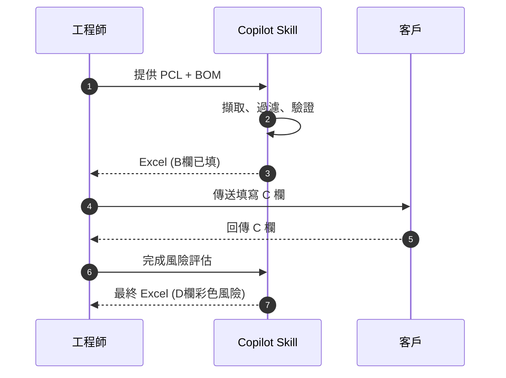
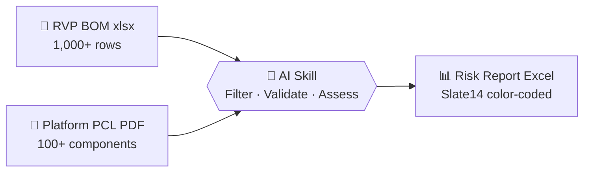
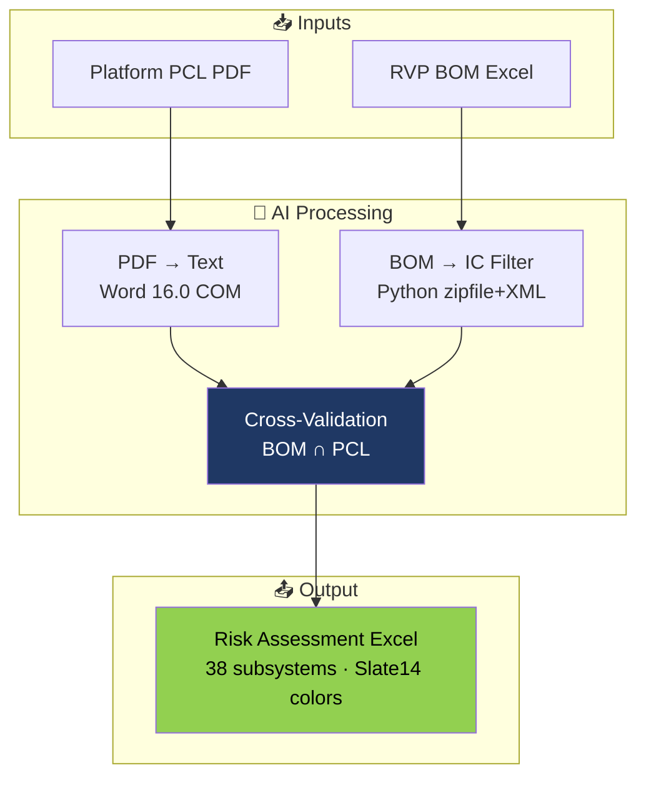
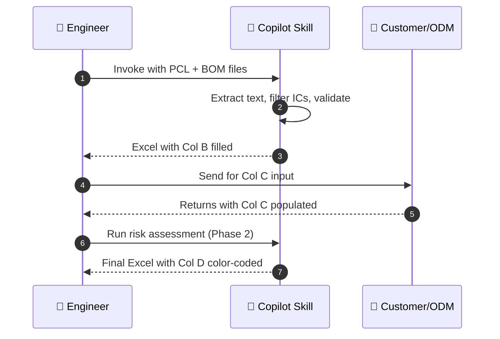

<h1 align="center">
  ⚡ BOM Risk Assessment
</h1>

<p align="center">
  <b>AI-Powered Platform Migration BOM Review — Built for Intel Hardware Engineers</b>
</p>

<p align="center">
  
  
  
  
</p>

<p align="center">
  <code>6+ hours of manual BOM review → under 10 minutes, fully automated.</code>
</p>

---

<details>
<summary><b>🇹🇼 繁體中文版本 (點擊展開)</b></summary>

<br/>

## 概述

此工具是 **GitHub Copilot Skill**，用於自動化 Intel 平台遷移 BOM 風險評估。  
工程師只需提供 RVP BOM + PCL PDF，AI 即自動完成 IC 識別、交叉驗證與風險報告生成。

### 核心價值

| 指標 | 手動作業 | AI 自動化 |
|------|:--------:|:---------:|
| 從 BOM 過濾 IC | 2–3 小時 | 即時 |
| 比對 PCL 文件 | 1–2 小時 | 即時 |
| 填寫參考 BOM 欄位 | 1 小時 | 自動 |
| 風險評估 + 上色 | 1–2 小時 | 自動 |
| **合計** | **6–9 小時** | **~10 分鐘** |

### 運作流程



### 驗證政策

```
✅ PCL 有 + BOM 有  →  "Part XYZ (PCL §x.y; RVP RefDes EUxxx)"
⚠️ BOM 有但 PCL 無 →  "Part XYZ (NOT in PCL; RVP RefDes EUxxx)"
⬜ 兩邊都沒有      →  "NA"
```

> **零虛構保證：** 未在實際檔案中找到的零件編號，絕不寫入報告。

### 快速使用

1. 在 VS Code 開啟 Copilot Chat
2. 輸入：`Perform BOM risk assessment for <platform>`
3. 提供 PCL PDF + RVP BOM Excel
4. AI 自動完成 B 欄 → 送客戶填 C 欄 → AI 自動完成 D 欄

### 安裝

```powershell
git clone https://github.com/billhsie/BOM_Risk_Assessment.git
Copy-Item -Recurse .github\skills\bom-risk <your-project>\.github\skills\
```

**需求：** Windows · Office (Excel + Word) · Python 3.x · VS Code + GitHub Copilot

</details>

---

## The Problem

Every Intel platform migration requires a BOM risk review:
- **1,000–2,000+ rows** of raw BOM data to sift through
- Cross-reference against PCL documents (PDF, 100+ components)
- Classify risk for each IC subsystem
- Produce color-coded Excel for management review

**This takes 6–9 hours per project.** Multiply by dozens of ODM engagements per year.

---

## The Solution



One command in VS Code Copilot Chat. No manual filtering. No guesswork.

---

## Key Features

| Feature | Description |
|---------|-------------|
| 🔍 **Smart IC Extraction** | Automatically filters resistors/capacitors, identifies ICs & controllers from 1,000+ BOM rows |
| 📋 **PCL Cross-Validation** | Extracts component data from PCL PDF and matches against BOM |
| 🎨 **Slate14 Output** | Color-coded Excel matching Intel's standard review format |
| 🛡️ **Zero Hallucination** | Dual-source verification — only writes what exists in source files |
| ⚡ **No Dependencies** | Python stdlib + Office COM only. No pip install, no network needed |
| 🔄 **Two-Phase Workflow** | Phase 1: Fill Col B (auto) → Phase 2: Fill Col D after customer Col C |

---

## Before / After

| Step | Manual | With This Skill |
|------|:------:|:---------------:|
| Filter ICs from raw BOM | 2–3 hrs | **Instant** |
| Cross-reference PCL | 1–2 hrs | **Instant** |
| Fill reference BOM column | 1 hr | **Auto** |
| Risk assessment + color coding | 1–2 hrs | **Auto** |
| **Total per project** | **6–9 hrs** | **~10 min** |

---

## How It Works



---

## Workflow



---

## Output Format

Matches **Intel Slate14 BOM Review Standard**:

| Column | Content | Owner |
|:------:|---------|:-----:|
| **A** | Subsystem (38 fixed entries) | Template |
| **B** | RVP Reference BOM | 🤖 AI |
| **C** | Customer BOM | 🏢 Customer |
| **D** | Risk Level & Recommendation | 🤖 AI |

### Risk Classification (Column D)

| Color | Level | Criteria |
|:-----:|:-----:|----------|
| 🟢 `#92D050` | **Low** | In PCL, co-using with RVP, or proven silicon |
| 🟡 `#FFFF00` | **Medium** | Not in current PCL but has different-gen validation |
| 🔴 `#C00000` | **High** | No validation data, security-critical, or different vendor |

---

## Verification Policy

Every data point requires **dual-source traceability**:

```
✅ In PCL + In BOM  →  "PS8825 (PCL §4.2 iPoR; RVP BOM U3201)"
⚠️ In BOM only      →  "RTQ3700HHN (NOT in PCL; RVP BOM U1234)"  
⬜ Not found         →  "NA"
```

> **Guarantee:** No part number is written unless it appears in the actual source files.  
> This eliminates the #1 risk in AI-assisted engineering: fabricated data.

---

## Quick Start

```powershell
# 1. Clone this repository
git clone https://github.com/billhsie/BOM_Risk_Assessment.git

# 2. Copy skill into your VS Code project
Copy-Item -Recurse .github\skills\bom-risk <your-project>\.github\skills\

# 3. Open VS Code Copilot Chat and invoke:
#    "Perform BOM risk assessment for <your-platform>"
```

### BOM Template Location

Use the published BOM template here:

- [.github/skills/bom-risk/templates/BOM_temp.xlsx](.github/skills/bom-risk/templates/BOM_temp.xlsx)

If you maintain a local copy at workspace root, keep it aligned with the template above.

### Requirements

| Requirement | Version |
|-------------|---------|
| Windows | 10/11 |
| Microsoft Office | Word + Excel (COM automation) |
| Python | 3.x (stdlib only, no pip) |
| VS Code | Latest + GitHub Copilot extension |

---

## One-Page SOP Cards (GitHub Copilot Skill)

### English (Share Card)

```text
[BOM Risk Assessment - GitHub Copilot Skill]

Repo:
https://github.com/billhsie/BOM_Risk_Assessment

Use in 5 minutes:
1) git clone https://github.com/billhsie/BOM_Risk_Assessment.git
2) cd BOM_Risk_Assessment
3) py -m pip install openpyxl
4) code .
5) Open Copilot Chat (Ctrl+Alt+I), switch to Agent mode
6) Prompt: Perform BOM risk assessment for <platform>

Two-phase workflow:
Phase 1:
- Input PCL PDF + BOM template
- Output: Excel with Column B filled

Phase 2:
- Customer returns file with Column C filled
- Prompt: Apply Phase 2 risk assessment using customer BOM at <path>
- Output: Final Excel with Column D risk color coding

Output file naming:
<Platform>_BOM_Risk_Assessment_YYYYMMDD_HHMMSS.xlsx

Need help:
Contact Bill Hsieh
```

### 繁體中文 (分享卡)

```text
[BOM Risk Assessment - GitHub Copilot Skill]

Repo:
https://github.com/billhsie/BOM_Risk_Assessment

5 分鐘上手:
1) git clone https://github.com/billhsie/BOM_Risk_Assessment.git
2) cd BOM_Risk_Assessment
3) py -m pip install openpyxl
4) code .
5) 開啟 Copilot Chat (Ctrl+Alt+I)，切換到 Agent mode
6) 輸入: Perform BOM risk assessment for <platform>

兩階段流程:
Phase 1:
- 提供 PCL PDF + BOM template
- 產出: B 欄已填的 Excel

Phase 2:
- 客戶回填 C 欄後回傳
- 輸入: Apply Phase 2 risk assessment using customer BOM at <path>
- 產出: D 欄完成風險顏色標示的最終 Excel

輸出檔名規則:
<Platform>_BOM_Risk_Assessment_YYYYMMDD_HHMMSS.xlsx

需要協助:
請聯絡 Bill Hsieh
```

---

## Repository Structure

```
BOM_Risk_Assessment/
├── README.md                          ← You are here
├── .github/
│   └── skills/
│       └── bom-risk/
│           ├── SKILL.md               ← Copilot skill definition
│           ├── README.md              ← Technical deep-dive
│           ├── scripts/
│           │   ├── bom_reader.py      ← BOM parser (no dependencies)
│           │   └── bom_writer.py      ← Excel generator (PowerShell COM)
│           └── references/
│               ├── risk_criteria.md   ← Risk classification rules
│               └── subsystem_template.md ← 38-entry subsystem list
└── .gitignore
```

**[→ Technical Details & Risk Criteria](.github/skills/bom-risk/README.md)**

---

## Supported Platforms

- [x] Arrow Lake (ARL)
- [x] Nova Lake (NVL) — Desktop / Mobile / Ultra
- [x] Panther Lake (PTL)
- [ ] Any Intel client platform with PCL + RVP BOM

## Roadmap

- [x] Multi-platform support (any PCL + BOM pair)
- [ ] Cross-generation co-using analysis
- [ ] GitHub Actions CI/CD integration
- [ ] PCL revision diff tracking
- [ ] Multi-platform side-by-side comparison

---

## Contributing

This skill works with **any Intel client platform**. To use on a new platform:

1. Provide the platform's PCL PDF + RVP BOM xlsx
2. (Optional) Customize `references/subsystem_template.md` for platform-specific subsystems
3. (Optional) Adjust `references/risk_criteria.md` for special risk rules

---

<p align="center">
  <b>Built with GitHub Copilot Agent Mode</b><br/>
  <sub>Intel Hardware Engineering · Platform Validation</sub>
</p>
